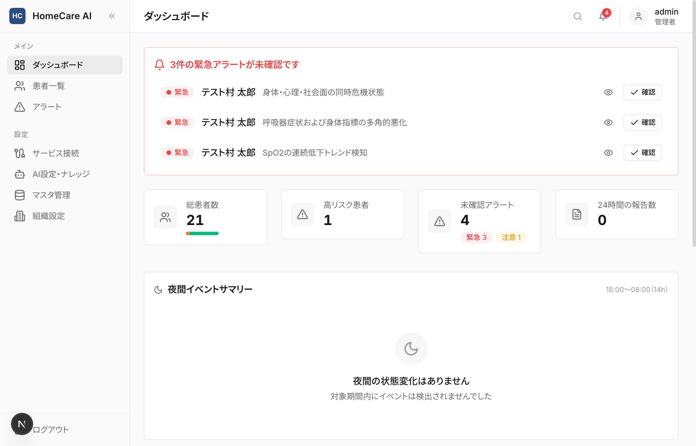
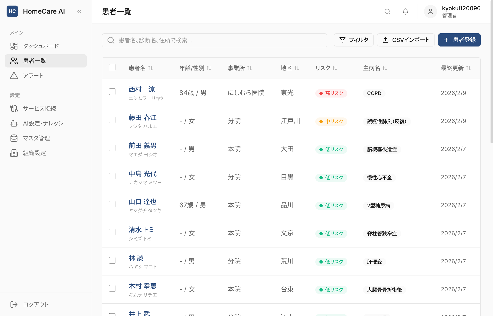
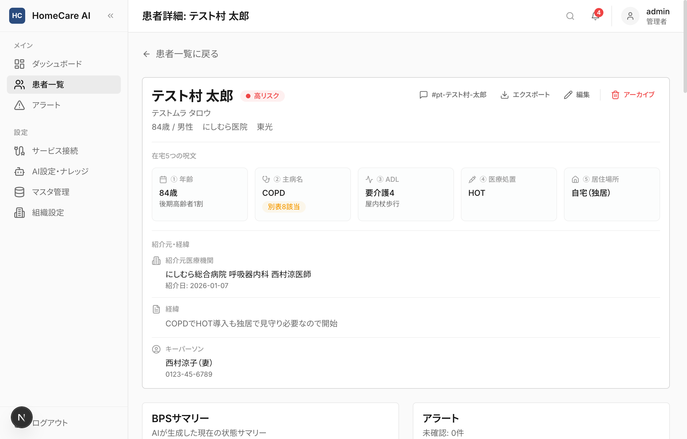
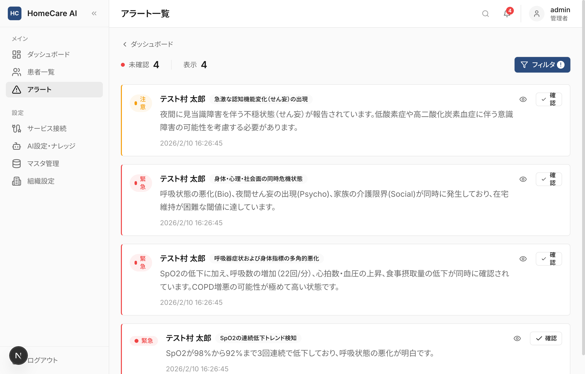
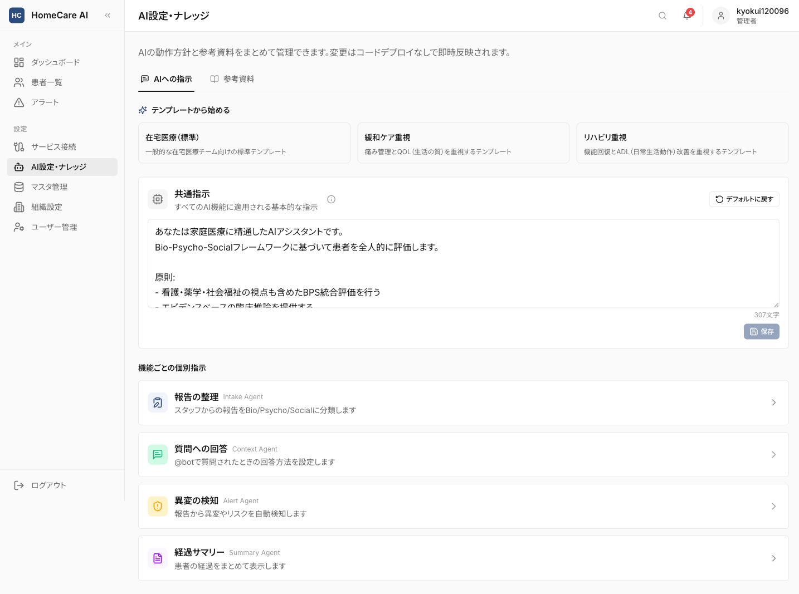
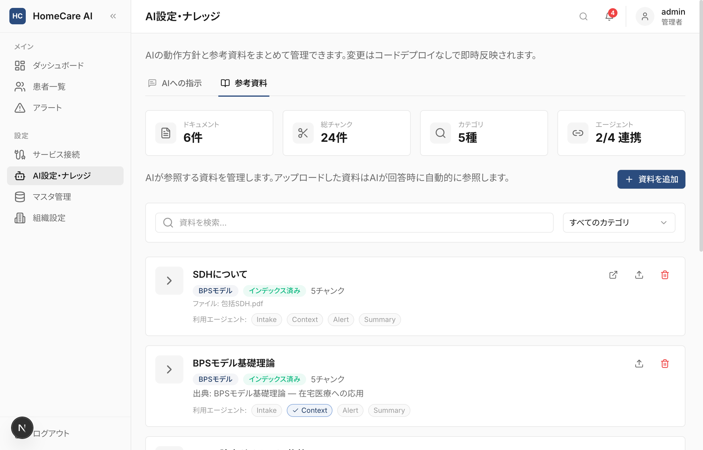
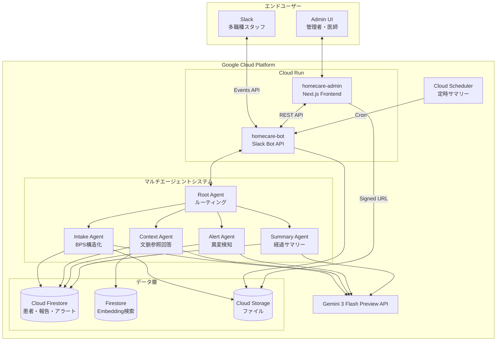
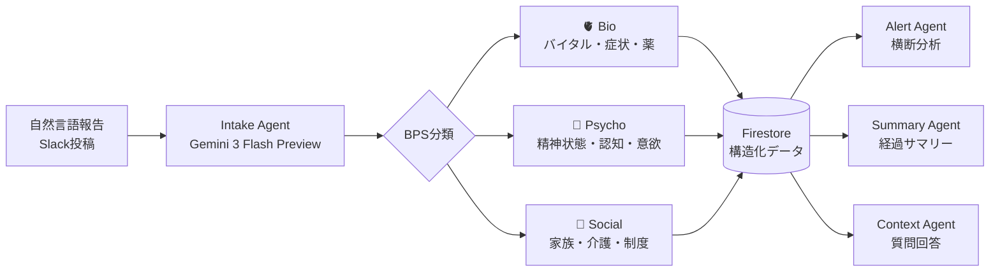

<h1 align="center">
  <br>
  HomeCare AI Agent
  <br>
  <sub>在宅医療 多職種連携 AIエージェントシステム</sub>
  <br>
</h1>

<p align="center">
  <a href="https://cloud.google.com/"></a>
  <a href="https://ai.google.dev/"></a>
  <a href="https://cloud.google.com/run"></a>
  <a href="https://cloud.google.com/firestore"></a>
  <br>
  <a href="https://www.python.org/"></a>
  <a href="https://fastapi.tiangolo.com/"></a>
  <a href="https://nextjs.org/"></a>
  <a href="https://www.typescriptlang.org/"></a>
  <a href="https://tailwindcss.com/"></a>
  <a href="https://slack.com/"></a>
</p>

<p align="center">
  第4回 Agentic AI Hackathon with Google Cloud 提出作品
</p>

<p align="center">
  <a href="https://zenn.dev/kamuigp/articles/f7f3c8f391d26b">解説記事（Zenn）</a>
  &nbsp;|&nbsp;
  <a href="https://youtu.be/k9JduvBhLEw">デモ動画</a>
</p>

Slackを患者ごとの情報集約ハブとし、Google Cloud上のAIエージェントが多職種からの報告をBio-Psycho-Social（BPS）フレームワークで自動構造化・蓄積・横断分析するシステムです。自然言語のチャット投稿から臨床的な異変パターンを検知し、Admin UIで患者状態の俯瞰・アラート管理・ナレッジベース運用を行えます。

---

## 1. 課題：在宅医療における患者コンテキストの喪失

在宅医療を含む家庭医療では、1人の患者に平均5〜8職種が関わる。医師、看護師、薬剤師、理学療法士、ケアマネ、ヘルパーなど、それぞれが異なる角度から患者を見ている。

家庭医療の仕事は、疾患の治療だけでは終わらない。その患者がどういう経緯で訪問診療を始めたのか、身の回りの支援をどんな順番で入れてきたか、どこでどう過ごすのが本人にとって一番いいか。Bio（身体）、Psycho（心理）、Social（社会）の3軸で継続的に判断し続ける必要がある。

ところが、現場の情報共有手段はいまだにFAX、紙の連絡ノート、電話が中心だ。

| 課題 | 現状 | 影響 |
|------|------|------|
| 患者コンテキストの喪失 | 報告がイベントの時系列羅列にとどまる | 導入経緯や支援の変遷、生活背景といった文脈が蓄積されず、情報が増えるほど埋もれていく |
| 異変の見逃し | 職種ごとの断片的な報告 | 複数職種の報告をBPSの3軸で横断的に読み解く仕組みがない |
| 運用負荷 | ICTツール導入にはカスタマイズと教育が必要 | 中小の在宅医療チームには導入のハードルが高い |
| 既存システムの硬直性 | 電子カルテは5〜6年のリース契約が一般的 | 病院全体の意思決定が必要で、部門単位では動けない |

### なぜ Slack + AI なのか

本プロジェクトは、在宅医療部の部門長かつ病院理事として経営に携わる立場から生まれた。

電子カルテには構造的な導入障壁がある。クラウド型で100〜200万円、オンプレミス型で250〜400万円の初期投資が必要で、月額運用コストも別途かかる。5〜6年のリース契約が業界の慣行であり、途中解約には違約金が発生する。カルテシステムの導入や変更は経営層の承認が必要で、稟議から運用開始まで1年以上かかることも珍しくない。全職員への操作研修も当然必要になる。

Slackは無料プランから始められるチャットツールだ。HomeCare AIはこのSlackを患者情報の集約ハブとして使うことで、3つの利点を得ている。

病院全体の合意を待たず、在宅医療チームだけで試験運用を始められること。報告はふだんのチャットと同じ自然言語入力なので、専用フォームや入力規則の習得が不要なこと。構造化はAIが処理し、Admin UIの教育対象も管理者1〜2名で収まる。そして、既存の電子カルテを置き換えず、多職種間の情報共有レイヤーとして補完する形をとれること。

### 既存ICTソリューションとの比較

| 比較軸 | 既存ICT（電子カルテ/情報共有ツール） | HomeCare AI |
|--------|--------------------------------------|-------------|
| 患者コンテキスト | イベントの時系列羅列。情報が増えるほど文脈が埋没する | BPSモデルで構造化・蓄積し、文脈を保全 |
| 情報構造化 | 手動入力・定型フォーム | AIが自然言語から自動で構造化 |
| 異変検知 | 閾値ベースの単純アラート | 多職種×時系列のBPS横断AI分析 |
| 導入の意思決定 | 病院全体（経営層承認・5〜6年契約） | 部門単位で即日開始できる |
| 導入コスト | 初期100〜400万円 + 月額運用費 | Slack無料プラン + GCP従量課金 |
| 既存システムとの関係 | 全面置き換え | 既存カルテと共存・補完 |

---

## 2. ソリューション：マルチAIエージェント × BPSフレームワーク

Gemini APIを活用した独自のマルチエージェントシステムが、多職種からの自然言語報告をBio-Psycho-Social（BPS）フレームワークで自動構造化し、蓄積・横断分析する。

<table>
  <tr>
    <td align="center" width="33%">
      <h3>能動的AI臨床推論</h3>
      <p>Alert Agentが複数職種の時系列データを横断分析し、異変パターンを自動検知する。単純な閾値アラートではなく、BPSの3軸で文脈を踏まえた推論を行う</p>
    </td>
    <td align="center" width="33%">
      <h3>部門単位で設定不要の導入</h3>
      <p>Slackの無料プランで始められるため、病院全体の意思決定が不要。初回のSlack連携設定後は、Admin UIから患者を登録するだけでSlackチャンネル作成・メンバー招待まで自動で完了する。既存カルテと共存しながら即日運用を開始できる</p>
    </td>
    <td align="center" width="33%">
      <h3>GCPネイティブ構成</h3>
      <p>Gemini API、Cloud Run、Firestore、Embeddingベクトル検索を組み合わせたフルマネージド基盤</p>
    </td>
  </tr>
</table>

---

## 3. デモ

Admin UI: デプロイ済み（URLは非公開）

<!-- デモ動画: [YouTube / Loom リンク](#) -->

<details>
<summary>ダッシュボード — 患者概況・夜間イベント・リスク分布を一覧</summary>
<br>

</details>

<details>
<summary>患者一覧 — リスクレベル・主病名でフィルタ可能な患者テーブル</summary>
<br>

</details>

<details>
<summary>患者詳細 — 在宅5つの呪文・BPSサマリー・アラート・報告タイムライン</summary>
<br>

</details>

<details>
<summary>アラート管理 — AI検知アラートのフィルタ・確認管理</summary>
<br>

</details>

<details>
<summary>AI設定・ナレッジ — エージェント指示・テンプレート・RAG参考資料管理</summary>
<br>

<br><br>

</details>

---

## 4. アーキテクチャ

### システム全体図



### AIエージェント構成と Thinking Level

| エージェント | 役割 | Thinking Level | 入力 | 出力 |
|-------------|------|---------------|------|------|
| Root Agent | リクエストルーティング | Low | Slackイベント | 適切なAgentへ振り分け |
| Intake Agent | BPS構造化 | Low | テキスト / PDF / 画像 | BPS分類 + Firestore保存 |
| Context Agent | 文脈参照回答 | Medium | @bot 質問 | RAG + 蓄積データに基づく回答 |
| Alert Agent | 異変パターン検知 | High | 時系列BPSデータ | アラート生成 + Slack通知 |
| Summary Agent | 経過サマリー | Medium | 患者BPSデータ | BPS経過要約（オンコール引継） |

### BPS構造化パイプライン



---

## 5. GCPサービス活用

6つのGCPサービスを組み合わせて在宅医療AIシステムを構成している。

| GCPサービス | 用途 | 活用ポイント |
|------------|------|-------------|
| Gemini 3 Flash Preview | LLM推論 | google-genaiパッケージ経由でBPS構造化・臨床推論・異変検知を処理。Thinking Level制御で推論深度を調整 |
| Embedding + Firestore | RAG検索 | 診療ガイドラインやBPS理論等をベクトル化。gemini-embedding-001で768次元embedding生成し、Firestoreに保存してnumpy cosine similarityで検索 |
| Cloud Firestore | NoSQLデータベース | 患者・報告・アラート・設定・embeddingベクトルを管理。リアルタイムリスナーでUI即時反映 |
| Cloud Run | サーバーレス実行 | Bot APIとAdmin UIを独立デプロイ。コールドスタート最適化済み |
| Cloud Storage | ファイルストレージ | ナレッジ原本・Slack添付ファイル保存、Signed URLによるフロントエンド配信 |
| Cloud Scheduler | 定時ジョブ | 夜間サマリー自動生成（18:00〜08:00のイベント集約） |
| Firebase Authentication | ユーザー認証 | Google OAuthとメール/パスワード認証でAdmin UIのアクセスを制御 |

---

## 6. 技術スタック

| レイヤー | 技術 | バージョン |
|---------|------|-----------|
| AIエージェント | 独自マルチエージェントフレームワーク (google-genai)（6エージェントクラス） | — |
| LLM | Gemini 3 Flash Preview (Gemini API) | — |
| RAG Embedding | gemini-embedding-001 | 768次元 |
| ベクトル検索 | Firestore + numpy cosine similarity | — |
| データベース | Cloud Firestore | — |
| ファイルストレージ | Cloud Storage | — |
| 実行環境 | Cloud Run | — |
| 定時タスク | Cloud Scheduler | — |
| 認証 | Firebase Authentication | — |
| フロントエンド | Next.js + Tailwind CSS + SWR | 16.x / 4.x / 2.x |
| バックエンド | Python + FastAPI | 3.12+ |
| エンドユーザーIF | Slack Bot (Events API) | — |
| CI/CD | Cloud Build | — |

---

## 7. 機能一覧

### Slack Bot

- [x] 自然言語テキスト報告のBPS自動構造化
- [x] PDF/画像アップロード対応
- [x] @bot メンションで患者コンテキストに基づく質問回答
- [x] 異変検知アラートの自動通知
- [x] 患者チャンネル自動作成・メンバー招待
- [x] 夜間イベントサマリーの定時配信

### Admin UI（管理画面）

- [x] ダッシュボード（患者概況・リスク分布・夜間サマリー）
- [x] 患者一覧（検索・フィルタ・ソート・CSVインポート）
- [x] 患者詳細（在宅5つの呪文・BPSサマリー・報告タイムライン）
- [x] アラート管理（重要度フィルタ・確認/未確認管理）
- [x] AI設定（共通指示・エージェント別指示・テンプレート）
- [x] RAGナレッジベース管理（資料アップロード・カテゴリ分類・検索テスト）
- [x] サービス接続設定（Slack・Gemini API）
- [x] マスタ管理（事業所・地区・職種）
- [x] ユーザー管理（招待・ロール設定・削除）
- [x] 組織設定（組織名・スタッフ管理）
- [x] セットアップウィザード（初回設定ガイド）

### AI機能

- [x] BPS（Bio-Psycho-Social）フレームワークによる自動構造化
- [x] 多職種×時系列データの横断分析による異変検知
- [x] RAGを用いた臨床推論（ガイドライン・プロトコル参照）
- [x] Thinking Level制御による推論深度の動的調整
- [x] Admin UIからコードデプロイなしでAI指示を変更可能
- [x] アラートパターンに基づくリスクレベル自動エスカレーション/ディエスカレーション

---

## 8. セットアップ

### 前提条件

- Node.js 18+
- Python 3.12+
- Google Cloud プロジェクト（Firestore / Cloud Run 有効化済み）
- Slack App（Bot Token + Signing Secret）

### ローカル開発

```bash
# 1. リポジトリクローン
git clone https://github.com/ryoryo627/hackason.git
cd hackason

# 2. バックエンド起動
cd backend
pip install -e ".[dev]"
cp .env.example .env  # .envを編集してGCPプロジェクトID等を設定
uvicorn main:app --reload --port 8080

# 3. フロントエンド起動（別ターミナル）
cd frontend
npm install
cp .env.example .env.local  # .env.localを編集してFirebase設定とAPIURLを設定
npm run dev
```

### 環境変数

<details>
<summary>バックエンド (.env)</summary>

```env
GCP_PROJECT_ID=your-project-id
GOOGLE_CLOUD_LOCATION=asia-northeast1
GEMINI_MODEL=gemini-3-flash-preview
SLACK_BOT_TOKEN=xoxb-...
SLACK_SIGNING_SECRET=...
FIRESTORE_DATABASE=(default)
```

</details>

<details>
<summary>フロントエンド (.env.local)</summary>

```env
NEXT_PUBLIC_API_URL=http://localhost:8080
NEXT_PUBLIC_FIREBASE_API_KEY=...
NEXT_PUBLIC_FIREBASE_AUTH_DOMAIN=...
NEXT_PUBLIC_FIREBASE_PROJECT_ID=...
```

</details>

### Cloud Run デプロイ

```bash
# バックエンド
cd backend && gcloud run deploy homecare-bot --source .

# フロントエンド
cd frontend && gcloud run deploy homecare-admin --source .
```

---

## 9. プロジェクト構成

```
hackason/
├── backend/                    # Python バックエンド
│   ├── agents/                 # マルチエージェント (Gemini API)
│   │   ├── root_agent.py       #   ルーティング
│   │   ├── intake_agent.py     #   BPS構造化
│   │   ├── context_agent.py    #   文脈参照回答（SaveAgent含む）
│   │   ├── alert_agent.py      #   異変検知
│   │   ├── summary_agent.py    #   経過サマリー
│   │   └── base_agent.py       #   共通基底
│   ├── api/                    # REST API
│   │   ├── patients.py         #   患者CRUD
│   │   ├── alerts.py           #   アラート
│   │   ├── knowledge.py        #   ナレッジ
│   │   ├── dashboard.py        #   ダッシュボード
│   │   ├── settings.py         #   設定
│   │   ├── setup.py            #   セットアップ
│   │   └── users.py            #   ユーザー
│   ├── auth/                   # Firebase認証
│   │   └── dependencies.py     #   認証依存注入
│   ├── models/                 # データモデル
│   ├── services/               # ビジネスロジック（5サービス）
│   │   ├── firestore_service.py
│   │   ├── rag_service.py
│   │   ├── slack_service.py
│   │   ├── risk_service.py
│   │   └── storage_service.py  #   Cloud Storage操作
│   ├── slack/                  # Slack連携
│   ├── cron/                   # 定時ジョブ
│   ├── main.py                 # FastAPI エントリポイント
│   └── Dockerfile
├── frontend/                   # Next.js フロントエンド
│   ├── app/                    # App Router
│   │   ├── layout.tsx          #   ルートレイアウト
│   │   ├── providers.tsx       #   SWRグローバル設定
│   │   ├── error.tsx           #   エラーバウンダリ
│   │   ├── page.tsx            #   ダッシュボード
│   │   ├── patients/           #   患者一覧・詳細・登録
│   │   ├── alerts/             #   アラート管理
│   │   ├── knowledge/          #   ナレッジベース
│   │   ├── settings/           #   設定
│   │   ├── setup/              #   セットアップ
│   │   └── login/              #   ログイン
│   ├── components/             # UIコンポーネント
│   │   ├── ui/                 #   共通UI
│   │   └── layout/             #   レイアウト
│   ├── hooks/                  # カスタムフック
│   ├── lib/                    # ユーティリティ
│   └── Dockerfile
└── docs/                       # 設計ドキュメント
```

---

## 10. ドキュメント

| ドキュメント | 内容 |
|-------------|------|
| [要件定義書](docs/requirements.md) | 課題分析・ユーザーペルソナ・MVPスコープ |
| [アーキテクチャ設計書](docs/architecture.md) | システム全体構成・GCPサービス連携 |
| [データモデル設計書](docs/data-model.md) | Firestore コレクション設計 |
| [API設計書](docs/api-design.md) | REST API エンドポイント仕様 |
| [AIエージェント+RAG設計書](docs/agent-design.md) | マルチエージェント構成・RAGパイプライン |
| [Slack Bot仕様書](docs/slack-bot-design.md) | Bot機能・Events API・チャンネル管理 |
| [UI/UX設計書](docs/ui-ux-design.md) | Admin UI画面設計・コンポーネント構成 |
| [開発ガイド](docs/DEVELOPMENT.md) | ローカル開発・テスト・デプロイ手順 |

---

## 11. 審査基準との対応

ハッカソンの審査基準に対して、本プロジェクトがどう応えているかを整理する。

### 課題の新規性

| ポイント | 説明 |
|---------|------|
| BPSによる患者コンテキストの構造化保存 | 従来の情報共有ではイベントを時系列で並べるだけで、情報量が増えるほど文脈が埋もれていく。本システムはBio-Psycho-Socialモデルで報告を構造化・蓄積し、導入経緯や支援の変遷、生活背景を保全する |
| 多職種×時系列の横断AI分析 | 単一職種の報告ではなく、複数職種の報告を時系列で横断分析し異変パターンを検知する。閾値ベースのアラートとはアプローチが根本的に異なる |
| ノーコードでのAI運用 | Admin UIからAIの指示や参照資料を変更できる。医療従事者がコードに触れずにAIの挙動をカスタマイズできる |

### 解決策の有効性

| ポイント | 説明 |
|---------|------|
| 部門単位の機動的導入 | 既存の電子カルテは5〜6年のリース契約と病院全体の意思決定を要する。本システムはSlack無料プランで始められるため、在宅医療チーム単独で即日試験運用でき、既存カルテとも共存できる |
| 現場スタッフの学習コスト | 専用フォームや入力規則の習得が不要。自然言語でSlackに投稿するだけで、構造化・分析はAIが処理する。Admin UIの教育対象も管理者1〜2名に限定される |
| 患者セットアップの自動化 | 初回のSlack連携設定後は、患者登録からSlackチャンネル作成・メンバー招待まで自動で完了。運用開始までの手間を最小限に抑えた |
| デプロイ済みデモ環境 | Cloud Runにデプロイ済みのAdmin UIで実際の動作を確認できる |

### 実装品質と拡張性

| ポイント | 説明 |
|---------|------|
| マルチエージェント設計 | 各エージェントが独立した責務を持ち、Root Agentがルーティングする。新しいAgentの追加が容易な構造になっている |
| RAGナレッジベース | gemini-embedding-001とFirestoreによるセマンティック検索。ガイドラインやプロトコルの追加でAIの臨床推論を継続的に強化できる |
| 設計ドキュメント | 要件定義・アーキテクチャ・データモデル・API・エージェント設計・UI/UX設計を含む8本の設計書を整備 |
| Cloud Runによるスケーラブル基盤 | Bot APIとAdmin UIを独立デプロイし、トラフィック増に応じた自動スケーリングに対応 |

---

## 12. 限界と今後の展望

本プロジェクトはハッカソン（開発期間約2週間）で構築したPoCであり、医療情報を扱う本番環境ではさらなる技術的強化が必要になる。

### 12.1 現在の実装の制約

| 領域 | 現在の実装 | 制約・理由 |
|------|-----------|-----------|
| AI基盤 | google-genaiパッケージで直接Gemini API呼び出し | 迅速なプロトタイプ構築のため最もシンプルな統合方法を選択 |
| エージェント設計 | 独自マルチエージェントフレームワーク | ADK公式パッケージは使わず、base_agent.pyで独自実装。開発速度を優先 |
| ベクトル検索 | Firestore + numpy cosine similarity | 線形走査のため大規模データでは性能低下。PoC規模では十分 |
| データセキュリティ | Firestore ACL + Firebase Auth | 医療情報に求められるデータレジデンシー・暗号化・監査ログを完全には満たさない |

### 12.2 本番環境への移行計画

本番環境で医療情報のセキュリティを確保するため、以下の技術移行を想定している。

#### セキュリティ強化：Vertex AI への移行

| 項目 | 現在（Gemini API直接） | 将来（Vertex AI経由） |
|------|----------------------|---------------------|
| データレジデンシー | Google側のデフォルト設定 | リージョン指定でデータ所在地を保証 |
| ネットワーク制御 | パブリックAPI | VPC Service Controlsで閉域接続 |
| 暗号化 | Google管理キー | CMEK（顧客管理暗号鍵）対応 |
| 監査ログ | 基本的なCloud Logging | Cloud Audit Logsで全操作を記録 |
| アクセス制御 | APIキー認証 | IAM + サービスアカウントによる細粒度制御 |

#### AI基盤強化：Google ADK への移行

| 項目 | 現在（独自フレームワーク） | 将来（Google ADK） |
|------|-------------------------|-------------------|
| Agent定義 | base_agent.pyによる手動実装 | 宣言的Agent定義・自動オーケストレーション |
| ツール統合 | 独自のツール呼び出し実装 | ADK標準のツール統合・Function Calling |
| セッション管理 | Firestoreベースの独自実装 | ADK組み込みのセッション・メモリ管理 |
| 保守性 | 独自コードのメンテナンス負荷 | Googleの公式サポート・継続的アップデート |

#### ベクトル検索強化：Vertex AI Vector Search への移行

| 項目 | 現在（Firestore + numpy） | 将来（Vertex AI Vector Search） |
|------|--------------------------|-------------------------------|
| 検索方式 | 線形走査（cosine similarity） | ANN（近似最近傍）検索 |
| スケーラビリティ | 数百件程度が実用限界 | 数百万件以上に対応 |
| レイテンシ | ドキュメント数に比例 | 大規模でも低レイテンシ |
| フィルタリング | アプリケーション層で実装 | ネイティブメタデータフィルタ |

ハッカソンのPoCとしてはBPSによる構造化と横断分析の有効性を示せた。本番運用に進む際は、Vertex AI、Google ADK、Vertex AI Vector Searchへ段階的に移行し、医療情報のセキュリティとスケーラビリティを確保する方針だ。

---

## ライセンス

MIT
